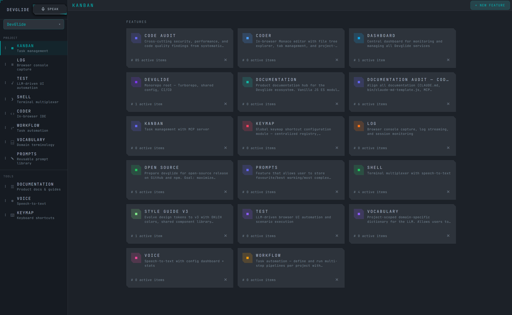
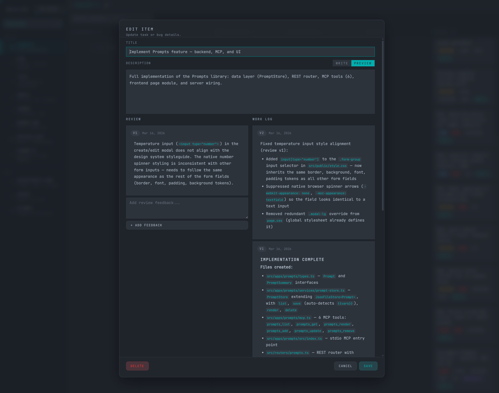
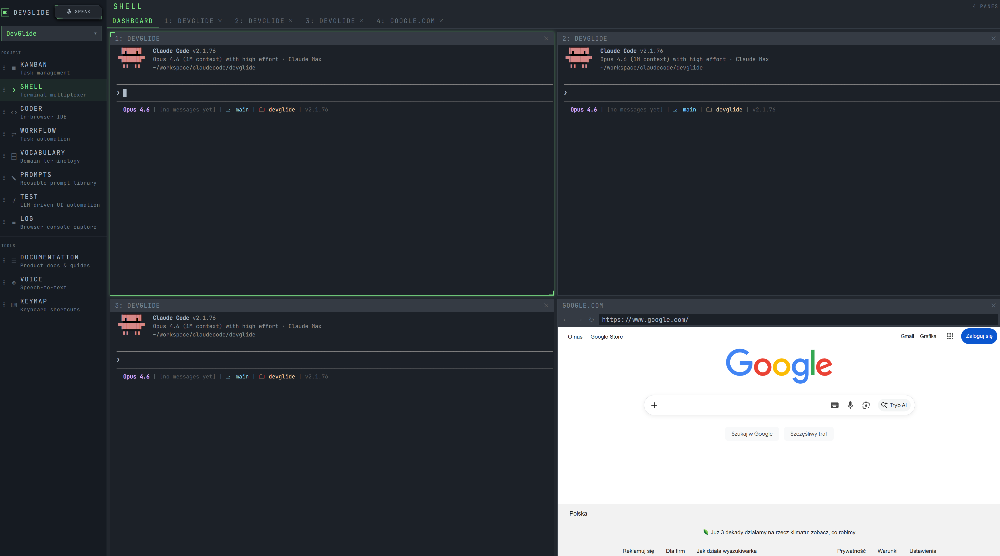
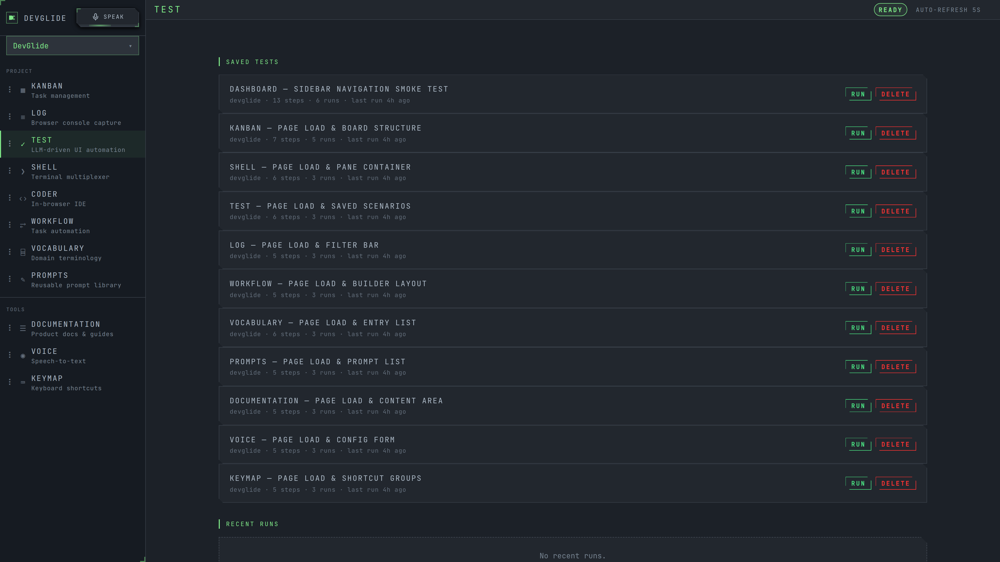
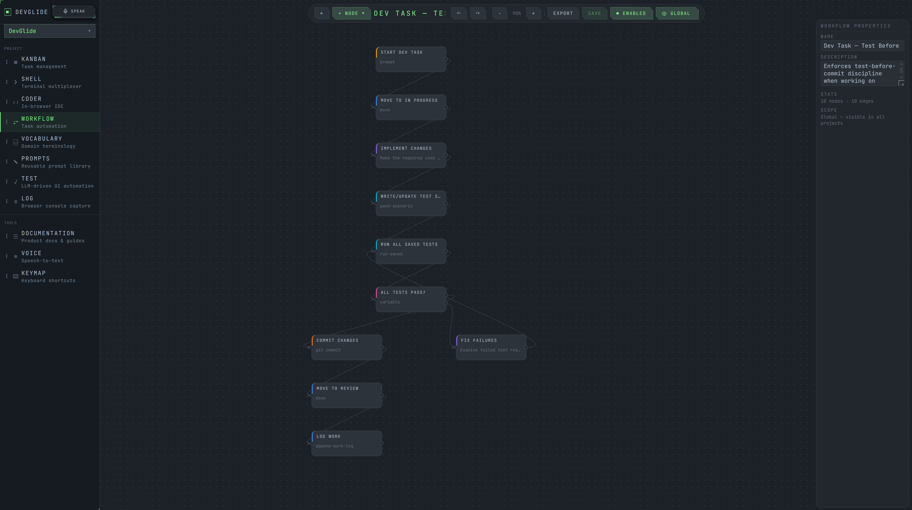
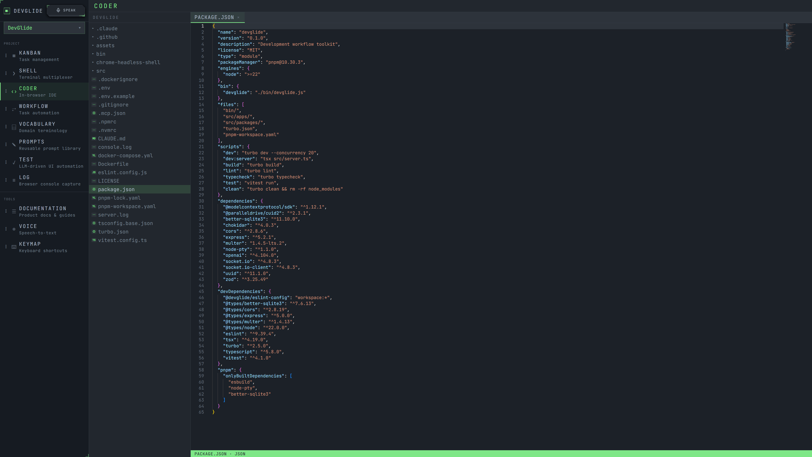
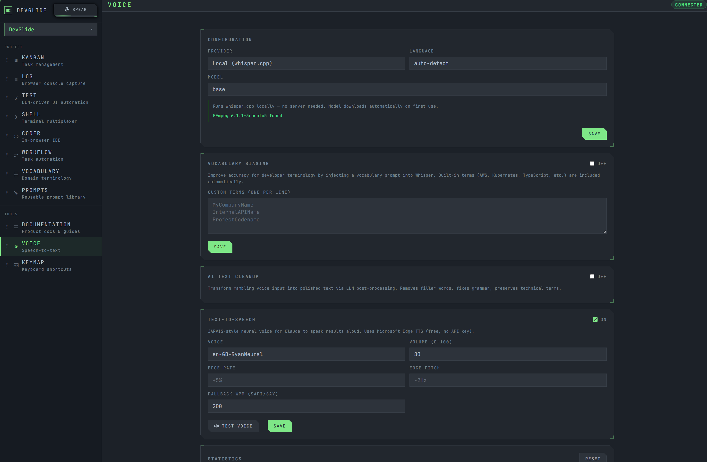
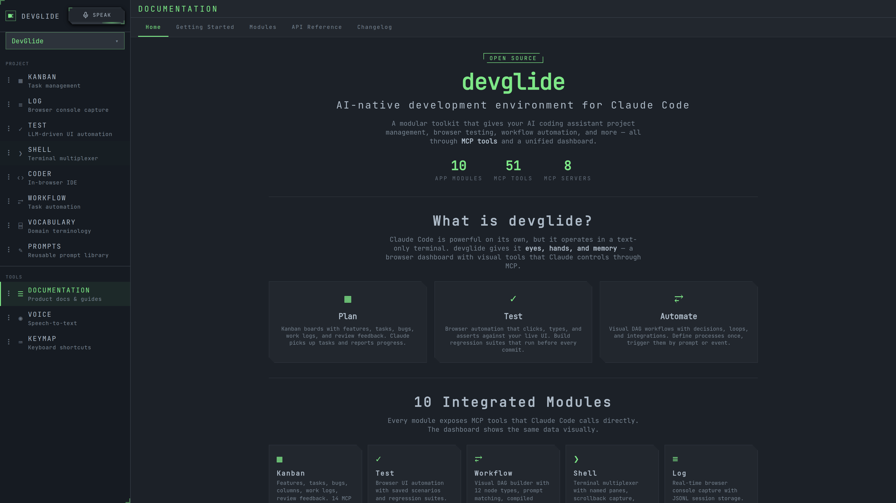

<p align="center">
  
</p>

<h1 align="center">devglide</h1>

<p align="center">
  <strong>AI-native development environment for Claude Code</strong><br/>
  A modular toolkit that gives your AI coding assistant project management, browser testing,<br/>
  workflow automation, and more — all through MCP tools and a unified dashboard.
</p>

<p align="center">
  <a href="#quick-start">Quick Start</a> &bull;
  <a href="#modules">Modules</a> &bull;
  <a href="#architecture">Architecture</a> &bull;
  <a href="#mcp-tools">MCP Tools</a> &bull;
  <a href="#license">License</a>
</p>

<p align="center">
  
  
  
  
  = 22" />
</p>

---

## What is DevGlide?

Claude Code is powerful on its own, but it operates in a text-only terminal. DevGlide gives it **eyes, hands, and memory** — a browser dashboard with visual tools that Claude controls through [MCP](https://modelcontextprotocol.io/).

**Plan** — Kanban boards with features, tasks, bugs, work logs, and review feedback. Claude picks up tasks, updates progress, and records what was done.

**Test** — Describe what to test in natural language and Claude generates browser automation scenarios automatically. Build regression suites that run before every commit.

**Automate** — Visual DAG workflows with shell commands, decisions, loops, and integrations. Define processes once, trigger them by prompt or event.

## Quick Start

```bash
# Install globally
npm install -g devglide

# Set up MCP servers and Claude Code integration
devglide setup

# Start the dashboard
devglide dev
```

Open **http://localhost:7000** — that's it. Claude Code can now use all 51 MCP tools.

> **Requirements:** Node.js >= 22, [Claude Code](https://docs.anthropic.com/en/docs/claude-code) CLI
>
> **Platforms:** Linux, macOS, and Windows (native, WSL, or Git Bash).

## Modules

DevGlide ships 10 integrated modules. Eight expose MCP servers that Claude Code calls directly; two are dashboard-only tools.

### Kanban — Task Management

Organize work into features with full kanban boards. Columns flow from Backlog through Done. Claude picks up tasks, moves them through stages, appends work logs, and records review feedback — all via MCP.



### Shell — Terminal Multiplexer

Multi-pane terminal dashboard with PTY emulation and 200KB scrollback per pane. Claude can create panes, run commands, and read output. Supports bash, cmd, and Git Bash on Windows, plus embedded browser views.



### Test — AI-Driven Browser Automation

Describe what to test in plain English and Claude generates browser automation scenarios automatically. Build a saved scenario library and run regression suites before every commit to catch breakages.



### Workflow — Visual DAG Builder

Define multi-step processes as directed acyclic graphs. Node types include shell commands, kanban ops, git ops, decisions, loops, HTTP calls, and sub-workflows. Claude matches user prompts to workflows automatically.



### Coder — In-Browser Editor

File tree viewer and editor for navigating your monorepo directly in the dashboard. Browse, read, and edit files without leaving the browser.



### Voice — Speech-to-Text

Configurable speech-to-text transcription with provider selection, model configuration, and usage statistics. Drop audio files or record directly for transcription.



### Documentation

Product docs and guides served directly in the dashboard with navigation, module reference, and API documentation.



### And More

| Module | Type | What it does |
|--------|------|-------------|
| **Vocabulary** | MCP | Domain-specific term dictionary for consistent AI interpretation |
| **Log** | MCP | Browser console capture, log streaming, and session tracking |
| **Prompts** | MCP | Reusable prompt template library with `{{variable}}` interpolation |
| **Keymap** | UI | Keyboard shortcut configuration dashboard |

## Architecture

```
┌─────────────────────────────────────────────────────────┐
│                    Claude Code (CLI)                     │
│                                                         │
│   "create a kanban task"    "run the smoke tests"       │
│   "check the logs"          "match a workflow"          │
└────────────┬────────────────────────┬───────────────────┘
             │ stdio (MCP)           │ stdio (MCP)
             ▼                       ▼
┌────────────────────────────────────────────────────────┐
│              DevGlide MCP Servers (x8)                 │
│                                                        │
│  kanban  shell  test  workflow  vocab  voice  log  prompts │
└────────────────────────┬───────────────────────────────┘
                         │
                    shared state
                         │
                         ▼
┌────────────────────────────────────────────────────────┐
│           Unified HTTP Server (:7000)                  │
│                                                        │
│   REST API    Socket.io    Static Assets    MCP/HTTP   │
│  /api/*       real-time    /app/*           /mcp/*     │
└────────────────────────┬───────────────────────────────┘
                         │
                         ▼
┌────────────────────────────────────────────────────────┐
│              Browser Dashboard                         │
│                                                        │
│  ┌────────┐ ┌────────┐ ┌────────┐ ┌────────┐         │
│  │ Kanban │ │ Shell  │ │  Test  │ │  Log   │  ...     │
│  └────────┘ └────────┘ └────────┘ └────────┘         │
└────────────────────────────────────────────────────────┘
```

**How it works:** `devglide setup` registers 8 MCP servers with Claude Code. Each server runs as an isolated stdio process. The same tools are also available via HTTP on the unified server, so the browser dashboard and Claude Code always share the same state.

## MCP Tools

51 tools across 8 servers. Expand each section for the full reference.

<details>
<summary><strong>Kanban</strong> — 15 tools</summary>

| Tool | Description |
|------|-------------|
| `kanban_list_features` | List all features with pagination |
| `kanban_create_feature` | Create a new feature board |
| `kanban_get_feature` | Get feature details with columns and tasks |
| `kanban_update_feature` | Update feature name, description, or color |
| `kanban_delete_feature` | Delete a feature and its tasks |
| `kanban_list_items` | List tasks/bugs with filtering and pagination |
| `kanban_create_item` | Create a new task or bug |
| `kanban_get_item` | Get full item details |
| `kanban_update_item` | Update item fields |
| `kanban_move_item` | Move item to a different column |
| `kanban_delete_item` | Delete a task or bug |
| `kanban_append_work_log` | Record work done (append-only, versioned) |
| `kanban_get_work_log` | Read full work log history |
| `kanban_append_review` | Add review feedback (append-only, versioned) |
| `kanban_get_review_history` | Read review history |

</details>

<details>
<summary><strong>Shell</strong> — 5 tools</summary>

| Tool | Description |
|------|-------------|
| `shell_list_panes` | List active terminal panes with CWD |
| `shell_create_pane` | Create a new terminal pane |
| `shell_close_pane` | Close a terminal pane |
| `shell_run_command` | Execute a command and capture output |
| `shell_get_scrollback` | Get recent terminal buffer |

</details>

<details>
<summary><strong>Test</strong> — 7 tools</summary>

| Tool | Description |
|------|-------------|
| `test_commands` | List available automation commands |
| `test_run_scenario` | Execute an ad-hoc test scenario |
| `test_save_scenario` | Save a scenario to the library |
| `test_list_saved` | List saved scenarios |
| `test_run_saved` | Run a saved scenario by ID |
| `test_delete_saved` | Remove a saved scenario |
| `test_get_result` | Check execution results and timing |

</details>

<details>
<summary><strong>Workflow</strong> — 6 tools</summary>

| Tool | Description |
|------|-------------|
| `workflow_list` | List all workflows |
| `workflow_get` | Get full workflow graph |
| `workflow_create` | Create a new workflow |
| `workflow_get_instructions` | Compile instructions from enabled workflows |
| `workflow_match` | Match user prompt to relevant workflows |
| `workflow_toggle` | Enable or disable a workflow |

</details>

<details>
<summary><strong>Vocabulary</strong> — 6 tools</summary>

| Tool | Description |
|------|-------------|
| `vocabulary_list` | List all term definitions |
| `vocabulary_lookup` | Look up a term by name or alias |
| `vocabulary_add` | Add a new term definition |
| `vocabulary_update` | Update an existing term |
| `vocabulary_remove` | Delete a term |
| `vocabulary_context` | Get all terms as compiled markdown |

</details>

<details>
<summary><strong>Voice</strong> — 2 tools</summary>

| Tool | Description |
|------|-------------|
| `voice_transcribe` | Transcribe audio to text |
| `voice_status` | Check service status and stats |

</details>

<details>
<summary><strong>Log</strong> — 4 tools</summary>

| Tool | Description |
|------|-------------|
| `log_write` | Append a log entry |
| `log_read` | Read recent log entries |
| `log_clear` | Clear a specific log file |
| `log_clear_all` | Clear all tracked session logs |

</details>

<details>
<summary><strong>Prompts</strong> — 6 tools</summary>

| Tool | Description |
|------|-------------|
| `prompts_list` | List prompts with filtering |
| `prompts_get` | Get full prompt with detected variables |
| `prompts_render` | Render template with variable substitution |
| `prompts_add` | Save a new prompt template |
| `prompts_update` | Update prompt content or metadata |
| `prompts_remove` | Delete a prompt |

</details>

## CLI Reference

```bash
devglide dev          # Run server in foreground (recommended)
devglide start        # Start as background daemon
devglide stop         # Stop the server
devglide restart      # Restart the server
devglide status       # Show running status
devglide logs         # Tail server logs
devglide setup        # Register MCP servers with Claude Code
devglide teardown     # Unregister MCP servers
devglide mcp <name>   # Launch a single MCP server on stdio
devglide list         # Show available MCP servers
```

## Tech Stack

| Layer | Technology |
|-------|-----------|
| Runtime | Node.js >= 22 (ES Modules) |
| Language | TypeScript 5.8 |
| Server | Express 5, Socket.io 4 |
| MCP | @modelcontextprotocol/sdk |
| Database | better-sqlite3 (embedded) |
| Terminal | node-pty |
| Monorepo | pnpm workspaces + Turborepo |
| Validation | Zod |
| Testing | Vitest |

## Project Structure

```
devglide/
├── bin/devglide.js          # CLI entry point
├── src/
│   ├── server.ts            # Unified HTTP server (:7000)
│   ├── apps/
│   │   ├── kanban/          # Task management
│   │   ├── shell/           # Terminal multiplexer
│   │   ├── test/            # Browser automation
│   │   ├── workflow/        # DAG workflow engine
│   │   ├── vocabulary/      # Domain terminology
│   │   ├── voice/           # Speech-to-text
│   │   ├── log/             # Console capture
│   │   ├── prompts/         # Prompt templates
│   │   ├── coder/           # In-browser editor
│   │   └── keymap/          # Keyboard shortcuts
│   └── packages/
│       ├── mcp-utils/       # MCP server factory
│       ├── design-tokens/   # UI design system
│       ├── shared-types/    # TypeScript types
│       └── ...
└── ~/.devglide/             # Runtime state (DB, logs, PIDs)
```

## Why DevGlide?

AI coding assistants are constrained by their interface. Claude Code runs in a terminal — it can read and write files, but it can't manage a project board, watch browser logs, run visual test suites, or follow repeatable workflows.

DevGlide bridges that gap. Instead of building one monolithic tool, it composes **small, focused MCP servers** that each do one thing well. Claude Code discovers them automatically and uses them as naturally as it uses `git` or `npm`.

The result: your AI assistant doesn't just write code — it **plans** work, **tests** the UI, **automates** processes, and **remembers** domain context. All while you watch it happen in a live dashboard.

## License

[MIT](LICENSE) &copy; 2026 Daniel Kutyla
